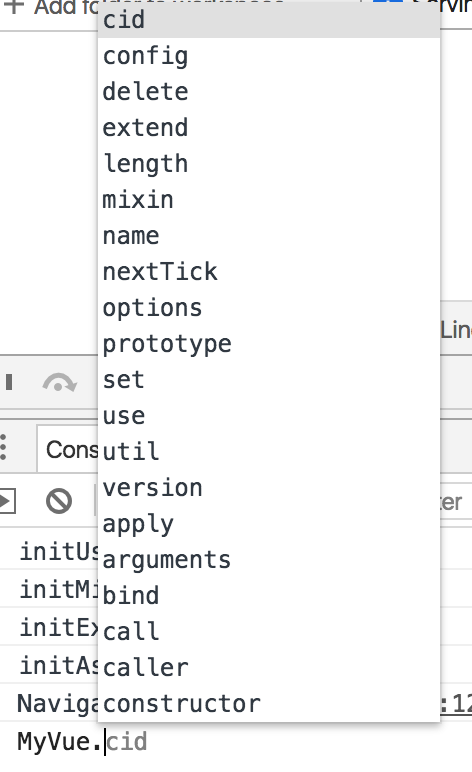
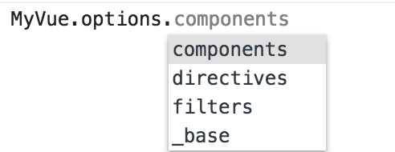
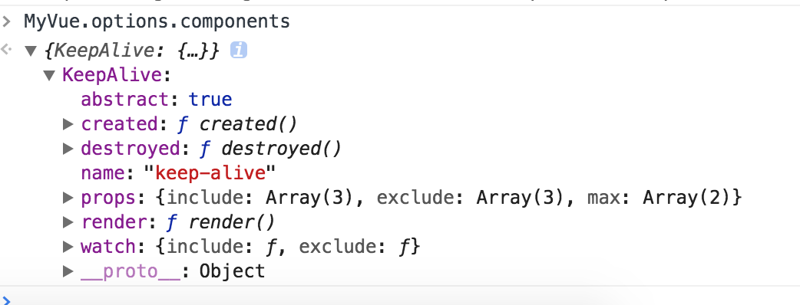
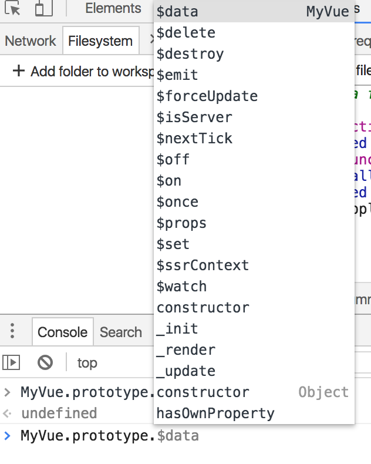

[学习代码仓库](https://github.com/cky917/vue-source-code-study)

<!-- more -->

# 初始化Vue流程

[入口](https://github.com/vuejs/vue/blob/dev/src/core/index.js)

`./core/instance/index.js`
定义了一个构造函数

然后执行了以下方法，给构造函数的原型加了一些属性和方法

```javascript
initMixin(Vue)
stateMixin(Vue)
eventsMixin(Vue)
lifecycleMixin(Vue)
renderMixin(Vue)
```

## 初始化原型（实例）的方法和属性

[initMixin](https://github.com/vuejs/vue/blob/dev/src/core/instance/init.js)方法给原型增加了`_init`方法，也就是每次执行`new Vew()`的时候都会调用。具体的后面再说。// TODO

[stateMixin](https://github.com/vuejs/vue/blob/dev/src/core/instance/state.js)给原型挂载了`$data`、`$props`属性，并重写了它们的`getter`,分别读取实例的`_data`和`_props`。
然后挂载了`$set`、`$del`、`$watch`方法，这些后面再细看。 // TODO

[eventMixin](https://github.com/vuejs/vue/blob/dev/src/core/instance/events.js)给原型挂载了`$on`、`$once`、`$off`、`$emit`方法，后续细看。// TODO

[lifecycleMixin](https://github.com/vuejs/vue/blob/dev/src/core/instance/lifecycle.js) 方法给原型定义了`_update`方法、以及`$forceUpdate`、`$destroy`, 后续细看 // TODO

[renderMixin](https://github.com/vuejs/vue/blob/dev/src/core/instance/render.js)方法给原型定义了`$nextTick`方法，并且执行了`installRenderHelpers`方法给原型增加了一系列私有的方法，和`_render`方法,后续细看 //TODO

最后抛出Vue构造函数

## 初始化全局api

然后执行[initGlobalApi(Vue)](https://github.com/vuejs/vue/blob/dev/src/core/global-api/index.js)方法，将一些方法和属性挂在构造函数上成为全局api
如：

- `Vue.config`（全局配置 [文档](https://cn.vuejs.org/v2/api/#silent))
- `Vue.util`(暴露出来的方法，但不是作为全局api考虑的，不建议使用)
- `Vue.set` [文档](https://cn.vuejs.org/v2/api/#Vue-set)
- `Vue.delete` [文档](https://cn.vuejs.org/v2/api/#Vue-delete)
- `Vue.nextTick` [文档](https://cn.vuejs.org/v2/api/#Vue-nextTick)

然后初始化options
`Vue.options = Object.create(null)`

`Vue.options.components`、
`Vue.options.directives`、
`Vue.options.filters` 都为一个空对象( `Object.create(null)`)

将这个状态的构造函数保存到`Vue.options._base`
然后执行
`extend(Vue.options.components, builtInComponents)`

[builtInComponents](https://github.com/vuejs/vue/blob/dev/src/core/components/keep-alive.js)返回的是一个对象

```javascript
export default {
  name: 'keep-alive',
  abstract: true,

  props: {
    include: patternTypes,
    exclude: patternTypes,
    max: [String, Number]
  },

  created () {
    this.cache = Object.create(null)
    this.keys = []
  },

  destroyed () {
    for (const key in this.cache) {
      pruneCacheEntry(this.cache, key, this.keys)
    }
  },

  watch: {
    include (val: string | RegExp | Array<string>) {
      pruneCache(this, name => matches(val, name))
    },
    exclude (val: string | RegExp | Array<string>) {
      pruneCache(this, name => !matches(val, name))
    }
  },

  render () {
    // 后面再细看
  }
}
```
因为`Vue.options.components`之前是初始化的一个空对象，所以`extend`处理之后，现在它变成了上述代码

然后顺序调用

- [initUse(Vue)](https://github.com/vuejs/vue/blob/dev/src/core/global-api/use.js)
- [initMixin(Vue)](https://github.com/vuejs/vue/blob/dev/src/core/global-api/mixin.js)
- [initExtend(Vue)](https://github.com/vuejs/vue/blob/dev/src/core/global-api/extend.js)
- [initAssetRegisters(Vue)](https://github.com/vuejs/vue/blob/dev/src/core/global-api/assets.js)

然后给`Vue.prototype`增加了`$isServer`、`$ssrContext`
两个字段
最后`Vue`增加了`version`字段

所以在还未进行任何操作，只是引入了Vue时，Vue的状态如下









## 知识点

[Object.defineProperty](https://developer.mozilla.org/zh-CN/docs/Web/JavaScript/Reference/Global_Objects/Object/defineProperty)